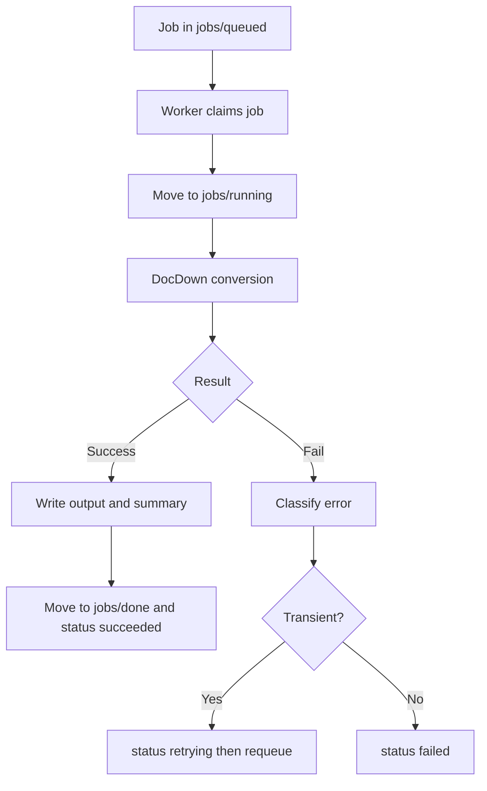

# Conversion Worker Runbook (Task 10.2)

## Purpose

Operational guide for running the DocDown conversion worker when GitHub is the control plane and the DocDownOps local polling runner service is the execution plane.

This runbook covers:

- start/stop/restart
- health and queue checks
- stuck-job diagnosis and recovery
- replay procedure by `job_id`

## Scope And Assumptions

- Worker runs on a local host under the DocDownOps polling runner service model.
- Job manifests are stored in an operations repository.
- Job state directories exist in ops repo:
  - `jobs/queued/`
  - `jobs/running/`
  - `jobs/done/`
  - `status/`
- Worker service name in examples: `docdown-conversion-worker`.

## Service Control

```bash
# status
sudo systemctl status docdown-conversion-worker --no-pager

# start
sudo systemctl start docdown-conversion-worker

# stop
sudo systemctl stop docdown-conversion-worker

# restart
sudo systemctl restart docdown-conversion-worker

# follow logs
sudo journalctl -u docdown-conversion-worker -f
```

## Health Checks

### Runner Host

```bash
python3 --version
qpdf --version
pandoc --version
gs --version
df -h /opt/docdown
```

Expected:

- Python meets minimum supported version.
- Required tools resolve (`qpdf`, `pandoc`, `gs`).
- Disk has enough free space for largest expected PDF and artifacts.

### Queue Surface

Check queue depth and stale running jobs from ops repo state.

```bash
# Example only; adapt paths/commands to implementation
find jobs/queued -type f | wc -l
find jobs/running -type f -mmin +30
```

Alert thresholds (initial defaults):

- queued jobs > 20 for more than 10 minutes
- any running job older than 30 minutes

## Normal Operating Flow



## Stuck Job Recovery

A job is considered stuck if it remains in `running` past timeout and no worker activity/log updates are observed.

### Step 1: Confirm Worker State

```bash
sudo systemctl status docdown-conversion-worker --no-pager
sudo journalctl -u docdown-conversion-worker --since "30 minutes ago"
```

### Step 2: Inspect Running Job Artifact Paths

- Verify workspace exists: `/opt/docdown/workspace/jobs/<job_id>`
- Check for active file changes in logs/output.

### Step 3: Classify

- transient candidate: network timeout, temporary git fetch failure, lock contention
- deterministic failure: invalid PDF, unsupported source path, policy violation

### Step 4: Recover

- If transient and attempts < max:
  - mark `status/<job_id>.json` as `retrying`
  - move manifest back to `jobs/queued/`
- If deterministic or attempts exhausted:
  - mark status `failed`
  - preserve logs and summary for submitter

### Step 5: Service Restart (if needed)

```bash
sudo systemctl restart docdown-conversion-worker
sudo systemctl status docdown-conversion-worker --no-pager
```

## Replay By Job ID

Use replay only after fixing root cause.

1. Locate job manifest and final status for `job_id`.
2. Copy failed manifest into a new queued job with:
   - new `job_id`
   - `replay_of` field pointing to original `job_id`
   - incremented attempt metadata reset for new job lifecycle
3. Keep original artifacts immutable for traceability.

## Incident Notes Template

For each incident, capture:

- `job_id`
- source locator (`repo/ref/path` or upload artifact ref)
- failure class (transient or deterministic)
- remediation action taken
- replayed (yes/no) and new `job_id` if replayed
- submitter-visible result link

## CD Handoff Note

CD is responsible for deploying worker code and restarting `docdown-conversion-worker`.

Runtime orchestration behavior (queue claim, retry policy, artifact persistence) is controlled by Task 10.2 implementation and this runbook.
