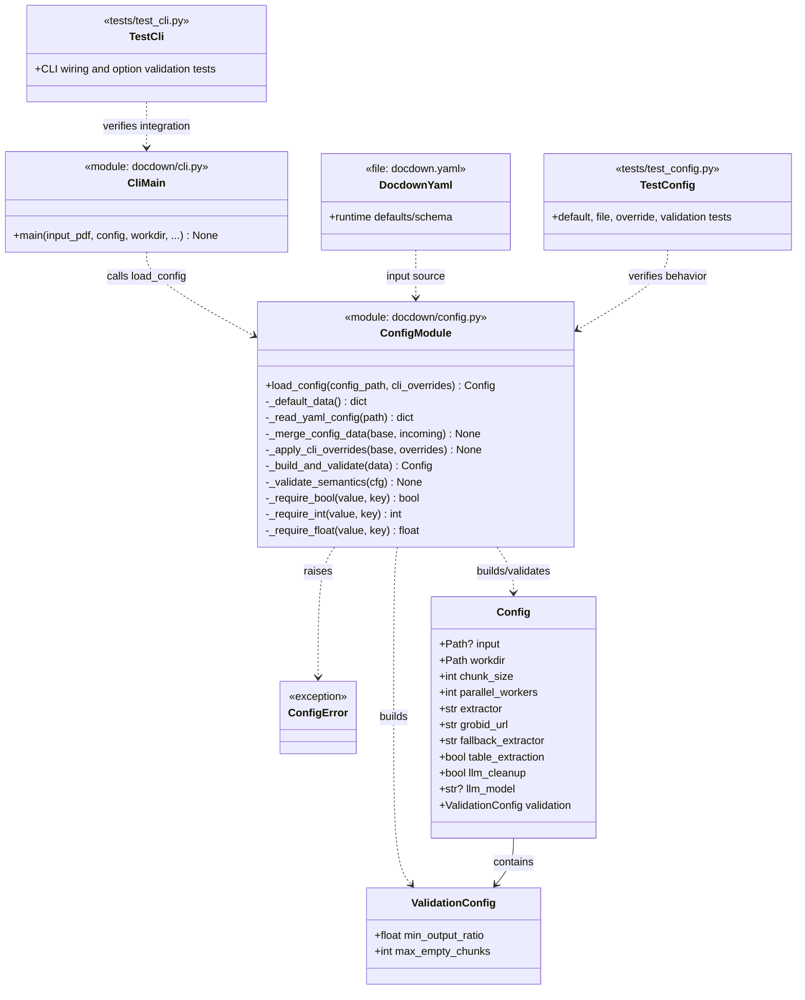

# Task 1.2 — Configuration System

## Summary

Implement configuration loading from a YAML file and CLI flags, with sensible defaults for all parameters.

## Dependencies

- Task 1.1 (project structure)

## Acceptance Criteria

- [x] `docdown.yaml` schema is defined and documented.
- [x] Configuration loads from file path specified via `--config` CLI flag.
- [x] CLI flags override config file values.
- [x] All parameters have defaults (pipeline runs without a config file).
- [x] Invalid configuration produces a clear error message and exits.
- [x] Configuration object is immutable after loading.
- [x] Unit tests cover: defaults, file loading, CLI overrides, validation errors.

## Implementation Notes

### Configuration schema

```yaml
input: null                        # required
workdir: ./output
chunk_size: 50
parallel_workers: 4
extractor: grobid                  # grobid | pdfminer
grobid_url: http://localhost:8070
fallback_extractor: pdfminer
table_extraction: true
llm_cleanup: false
llm_model: null
validation:
  min_output_ratio: 0.01
  max_empty_chunks: 0
```

### Design

- Use a dataclass or Pydantic model for typed, validated config.
- Load order: defaults → YAML file → CLI flags.
- Validate `extractor` and `fallback_extractor` are valid choices.
- Validate `chunk_size` > 0, `parallel_workers` ≥ 1.

### Artifact Class Diagram



## References

- [technical-design.md §4 — Configuration](../technical-design.md)
