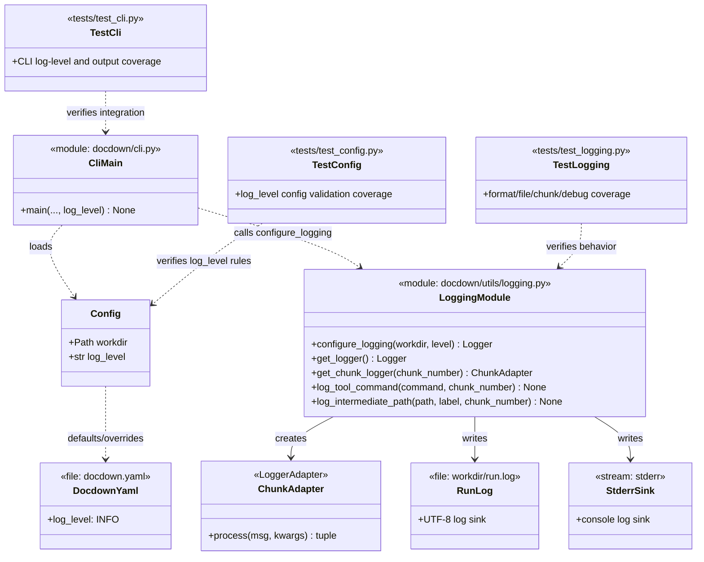

# Task 1.3 — Logging Framework

## Summary

Set up structured logging with configurable levels, file output, and per-chunk context.

## Dependencies

- Task 1.1 (project structure)

## Acceptance Criteria

- [x] All pipeline output is logged via a central logger (no bare `print` statements).
- [x] Log output writes to both stderr and `workdir/run.log`.
- [x] Log level is configurable (default: `INFO`).
- [x] Each log entry includes: timestamp, level, and chunk identifier (where applicable).
- [x] `DEBUG` level includes tool command lines and intermediate file paths.
- [x] Unit tests verify log format and file output.

## Implementation Notes

### Format

```
2026-03-19T10:15:32 INFO  [chunk-0007] GROBID extraction complete (12.3s)
2026-03-19T10:15:33 WARN  [chunk-0007] Output size below threshold (0.8%)
```

### Design

- Use Python's `logging` module with a custom formatter.
- Create a `ChunkAdapter` or use `LoggerAdapter` to inject chunk ID into log records.
- File handler is added once `workdir` is created (Task 1.4).

### Artifact Class Diagram



## References

- [technical-design.md §9.2 — Logging](../technical-design.md)
