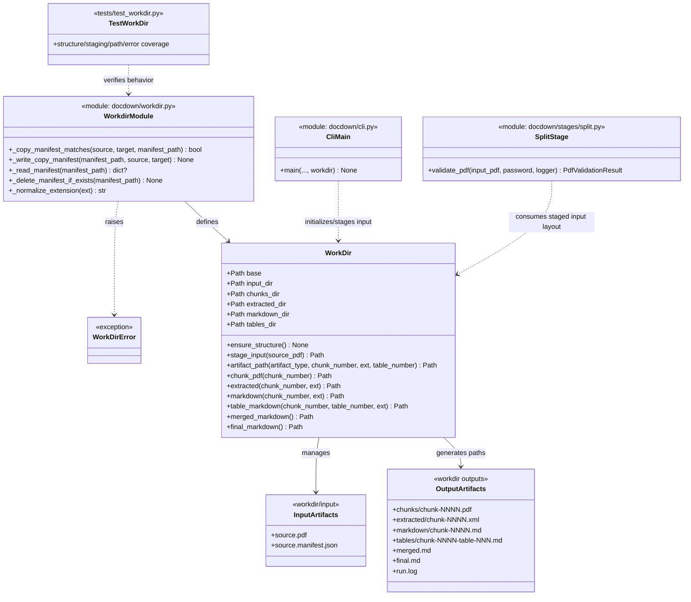

# Task 1.4 — Working Directory Management

## Summary

Create and manage the working directory structure where all intermediate and output files are stored.

## Dependencies

- Task 1.2 (configuration — needs `workdir` path)

## Acceptance Criteria

- [x] Working directory is created at the configured `workdir` path.
- [x] Subdirectories are created: `input/`, `chunks/`, `extracted/`, `markdown/`, `tables/`.
- [x] If `workdir` already exists, pipeline resumes without deleting previous files (allows reprocessing).
- [x] Input PDF is copied or symlinked into `input/`.
- [x] A helper function returns the path for any artifact given its type and chunk number.
- [x] Unit tests verify directory creation and path generation.

Implemented in:
- `docdown/workdir.py`
- `docdown/cli.py`
- `tests/test_workdir.py`

## Implementation Notes

### Directory structure

```
workdir/
├── input/
├── chunks/
├── extracted/
├── markdown/
├── tables/
├── merged.md
├── final.md
└── run.log
```

### Path helper

```python
class WorkDir:
    def __init__(self, base: Path):
        self.base = base
    
    def chunk_pdf(self, n: int) -> Path:
        return self.base / "chunks" / f"chunk-{n:04d}.pdf"
    
    def extracted(self, n: int, ext: str = "xml") -> Path:
        return self.base / "extracted" / f"chunk-{n:04d}.{ext}"
    
    def markdown(self, n: int) -> Path:
        return self.base / "markdown" / f"chunk-{n:04d}.md"
    
    # etc.
```

### Artifact Class Diagram



## References

- [technical-design.md §3 — Directory & File Layout](../technical-design.md)
