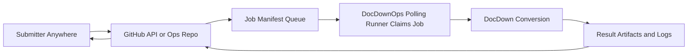
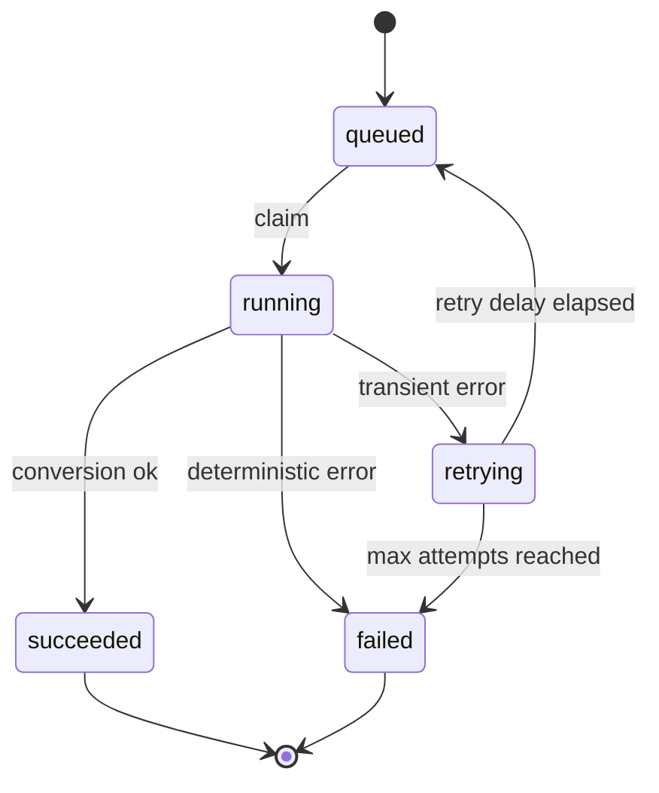

# Task 10.2 - Conversion Workflow Orchestration And Operations Model

## Summary

Define and implement the document-conversion operating workflow so production usage is reliable and aligned with CI/CD deployment behavior.

This task focuses on runtime operations for conversion jobs, not repository validation/deployment automation.

## Dependencies

- Task 10.1 (CI/CD pipeline and deployment workflow)

## Acceptance Criteria

- [x] A conversion workflow model is documented (intake -> queue -> worker -> artifacts -> status).
- [x] Job states are defined and used consistently (`queued`, `running`, `succeeded`, `failed`, `retrying`).
- [x] Retry policy distinguishes transient failures from deterministic failures.
- [x] Artifact storage layout is defined for traceability (input, final markdown, logs, summary per job).
- [x] Idempotency strategy is documented (input hash + options).
- [x] Operational limits are documented (max input size/pages, timeout policy, concurrency caps).
- [x] A runbook exists for start/stop/restart, diagnosis, and recovery for the conversion worker/service.
- [x] CI/CD handoff to runtime workflow is documented (what CD deploys and what it restarts).

## Implementation Notes

### Scope

The goal is to make conversion execution operationally safe in production. CI/CD should deploy and restart runtime components, while this task defines and stabilizes how conversion work is accepted, processed, and observed.

### Terminology And Boundary

- Task 10.1 CD runner: GitHub Actions self-hosted runner on node01 by default, with node02 as fallback for repository deployment workflow.
- Task 10.2 ops runner: local DocDownOps polling service (`runner-loop.sh`) on node01 by default, with node02 as standby/failover for job execution.
- These are separate runtime concerns even if they run on the same hosts.

### Operating Constraint

- Conversion execution remains on a local LAN-hosted DocDownOps polling runner/service.
- Submission and status must be available from anywhere with GitHub access.
- Therefore, runtime orchestration should use GitHub as the control plane and the DocDownOps local polling runner service as the execution plane.

### Recommended V1 Architecture

- `docdown-ops` (or equivalent operations repo) hosts job manifests and status updates.
- Submitters create jobs through GitHub-facing channels:
  - workflow dispatch
  - issue/PR command
  - CLI that writes job manifests to ops repo
- DocDownOps local polling runner service polls/claims jobs from ops repo and performs conversion.
- Results are published back to GitHub (artifacts and/or commit/PR), so submitter can access markdown remotely.

### Recommended Baseline

- Intake:
  - `source.type = git` for v1 default (repo/ref/path)
  - optional `source.type = upload` through CLI helper that uploads to intake repo
- Queue:
  - git-backed job manifests in ops repo (`jobs/queued/*.json`)
- Worker:
  - DocDownOps polling runner service claims by moving manifest to `jobs/running/`
  - isolated workdir per job (`/opt/docdown/workspace/jobs/<job_id>`)
- Artifacts:
  - per-job output tree containing staged input, final markdown, logs, run summary
  - publish result pointer back to job status in ops repo
- Observability:
  - status file per job (`queued`, `running`, `succeeded`, `failed`, `retrying`)
  - queue depth and age derived from queued manifests

### Job Contract (V1)

Job manifest fields:

- `job_id`: unique id (`YYYYMMDDHHMMSS-<shortsha>-<nonce>`)
- `submitted_at`, `submitted_by`
- `source`:
  - `type`: `git` | `upload`
  - `repo`, `ref`, `path` (for `git`)
  - `artifact_ref` (for `upload`)
- `options`:
  - profile/config overrides allowed by policy
- `idempotency_key`:
  - hash of source locator + options
- `result`:
  - output target mode (`artifact` | `commit` | `pr`)

### Job Lifecycle

Retry policy:

- Retry transient classes only (git clone timeout, network reset, temporary disk pressure).
- Do not retry deterministic classes (invalid PDF, unsupported input, policy violation).
- Include attempt count and last error classification in job status.

### Artifact And Traceability Layout

Per job root:

- `input/`: staged source PDF
- `output/final.md`: final markdown deliverable
- `output/assets/`: extracted images or attachments
- `logs/run.log`: execution log
- `logs/stderr.log`: stderr capture
- `summary.json`: timings, versions, exit status, hash metadata

### Submitter Access Model

- Submitter receives `job_id` immediately.
- Submitter checks status via GitHub-visible job status file or status endpoint.
- On success, submitter gets direct markdown location:
  - artifact download URL, or
  - commit/PR URL containing generated markdown.

### Security And Access Policy

- Allowlist repos for `source.type = git`.
- Use least-privilege token or GitHub App installation for read/write operations.
- Do not read arbitrary LAN-local submitter paths directly from remote requests.
- Treat upload helper as explicit handoff into GitHub-accessible storage.

### Operational Limits (Initial Defaults)

- Max PDF size: 150 MB
- Max pages: 1500
- Max wall-clock per job: 30 minutes
- Max concurrent jobs per DocDownOps polling runner service: 1 (increase after soak)
- Retention:
  - keep last 30 days of artifacts
  - keep failure logs for 60 days

### Integration Boundary With Task 10.1

- Task 10.1 provides CI/CD pipelines and deployment mechanics.
- Task 10.2 provides runtime conversion orchestration and operations policy.
- Task 10.1 CD runs through GitHub Actions on the DocDown self-hosted runner.
- Task 10.2 execution runs through the DocDownOps local polling runner/service.
- CD should restart or reload the conversion service defined in this task when that service is part of deployed runtime.

### Operational Verification (2026-04-14)

- Task 10.1: node01 is configured as the active GitHub Actions self-hosted CD runner and validated with a green smoke deploy.
- Task 10.1: node02 remains configured as CD standby/fallback and should stay disabled unless failover is needed.
- Task 10.2: DocDownOps runner-loop setup runbook is created for node01 primary and node02 standby local job execution.

### Current Host Status (2026-04-15)

- Task 10.1 / node01:
  - GitHub Actions CD runner service is installed, enabled, and running.
  - Deploy prerequisites are confirmed present: `python3`, `qpdf`, `pandoc`, `gs`, `/usr/local/bin/docdown-activate-release`, and `/opt/docdown/shared/wheelhouse`.
- Task 10.1 / node02:
  - GitHub Actions CD runner service is installed, disabled, and inactive as intended for standby.
  - Deploy prerequisites are confirmed present: `python3`, `qpdf`, `pandoc`, `gs`, `/usr/local/bin/docdown-activate-release`, and `/opt/docdown/shared/wheelhouse`.
- Task 10.2 / node01:
  - DocDownOps repo clone exists.
  - `/etc/default/docdownops-runner` exists.
  - `docdownops-runner.service` is installed and enabled.
  - `docdownops-runner.service` is active and polling normally on a 10-second interval.
  - Repo-managed executor script is installed at `/opt/docdown-ops/releases/docdownops-main/scripts/docdown-execute-manifest.sh`.
  - `runner-loop.sh` was corrected so `claim-job.sh` exit code `3` (`no queued jobs`) is treated as idle sleep instead of service failure.
  - GitHub App credentials are installed outside the repository and readable by `docdown-runner`.
  - GitHub App token minting and repo-managed authenticated `git fetch`, `git pull`, and `git push` are verified.
  - `scripts/docdown-execute-manifest.sh` now tracks executable mode from Git and the local checkout can be kept clean.
  - Writeback sync settings are appended in `/etc/default/docdownops-runner` (`DOCDOWN_GIT_SYNC_ENABLED=true`, deterministic runner commit identity).
  - Temporary GitHub App validation branches have been deleted from origin.
  - Post-restart health with authenticated sync enabled is verified: periodic authenticated refresh shows `Already up to date.` and idle polling shows `No queued jobs available to claim.` while the service stays `active (running)`.
  - First live workflow-dispatched job (`20260415090651-ed80d4`) completed successfully through the sync-enabled runner path.
  - Controlled failover was validated by stopping/disabling node01, activating node02, and completing a real workflow-dispatched job through the standby node.
- Task 10.2 / node02:
  - DocDownOps repo clone exists.
  - `/etc/default/docdownops-runner` exists.
  - `docdownops-runner.service` is installed and has been validated both as disabled standby and as active failover runner.
  - Repo-managed executor script is installed at `/opt/docdown-ops/releases/docdownops-main/scripts/docdown-execute-manifest.sh`.
  - GitHub App credentials are installed outside the repository and readable by `docdown-runner`.
  - GitHub App token minting and repo-managed authenticated `git fetch`, `git pull`, and `git push` are verified.
  - `scripts/docdown-execute-manifest.sh` now tracks executable mode from Git and the local checkout can be kept clean.
  - Writeback sync settings are appended in `/etc/default/docdownops-runner` (`DOCDOWN_GIT_SYNC_ENABLED=true`, deterministic runner commit identity).
  - Temporary GitHub App validation branches have been deleted from origin.
  - Controlled failover job `20260415102641-543c64` completed successfully through node02 with the same authenticated sync/writeback path and submitter-visible `result_url` publication.

### Delivery Plan (V1)

1. [x] Create ops repo structure (`jobs/queued`, `jobs/running`, `jobs/done`, `status`).
2. [x] Implement submit path (`workflow_dispatch` + JSON manifest validation).
3. [x] Implement claim/lock behavior in the DocDownOps polling runner service.
4. [x] Implement conversion executor with standardized artifact layout.
5. [x] Publish status transitions and result links to submitter-visible location via DocDownOps polling runner integration.
6. [x] Add runbook for restart, stuck-job recovery, and replay by `job_id`.
7. [x] Validate Task 10.1 node01 primary CD runner end-to-end (registration, prerequisites, and smoke deploy).

### Detailed Delivery Checklist

Use this checklist as the operational breakdown for the remaining Task 10.2 work.

1. Control Plane Baseline
  - [x] Create DocDownOps repo structure and queue/state layout.
  - [x] Add GitHub-facing submit workflow for queued job creation.
  - [x] Define job manifest contract and status model.

2. Host And Service Setup
  - [x] Document node01 primary and node02 standby setup for the DocDownOps polling runner service.
  - [x] Install DocDownOps polling runner service on node01.
  - [x] Install DocDownOps polling runner service on node02.
  - [x] Enable/start node01 DocDownOps polling runner service.
  - [x] Disable/stop node02 DocDownOps polling runner service as standby default.
  - [x] Configure `DOCDOWN_JOB_EXECUTOR` on node01.
  - [x] Configure `DOCDOWN_JOB_EXECUTOR` on node02.

3. GitHub Writeback Credentials
  - [x] Choose node-local writeback auth strategy for DocDownOps (`GitHub App`, fine-grained PAT, or SSH key).
  - [x] Provision write-capable credentials on node01 for DocDownOps repo updates.
  - [x] Provision write-capable credentials on node02 for failover operation.
  - [x] Store credentials outside the repository in a host-local secure location (environment file, credential helper, or app flow).
  - [x] Verify node01 can authenticate for fetch/pull/push against DocDownOps.
  - [x] Verify node02 can authenticate for fetch/pull/push against DocDownOps.

4. Polling Runner Writeback And Sync
  - [x] Implement controlled git sync/writeback for the DocDownOps polling runner service.
  - [x] Fetch/rebase before local state updates are pushed.
  - [x] Commit status/history/manifest transitions with predictable commit messages.
  - [x] Push `jobs/running -> jobs/done` and `status/*` updates back to origin.
  - [x] Handle push conflicts/retries safely when multiple writers exist.
  - [x] Document recovery procedure for failed local commit/push operations.

5. Conversion Executor Integration
  - [x] Implement `DOCDOWN_JOB_EXECUTOR` command contract for manifest-driven execution.
  - [x] Materialize per-job workspace under `/opt/docdown/workspace/jobs/<job_id>`.
  - [x] Stage input PDF from declared source.
  - [x] Run DocDown conversion with controlled config/options.
  - [x] Write standardized artifacts (`input/`, `output/`, `logs/`, `summary.json`).
  - [x] Classify failures as transient vs deterministic.
  - [x] Emit result URL or pointer when available.

6. Status And Result Publication
  - [x] Publish `running`, `succeeded`, `failed`, and `retrying` states back to DocDownOps origin.
  - [x] Preserve attempt counts across retries.
  - [x] Append status transitions to `status/history/<job_id>.jsonl`.
  - [x] Publish submitter-visible result link (`artifact`, `commit`, or `pr`).
  - [x] Ensure failed jobs include a usable diagnostic message/log pointer.

7. End-To-End Validation
  - [x] Submit a real DocDownOps job through `workflow_dispatch`.
  - [x] Verify node01 DocDownOps polling runner service claims the queued job.
  - [x] Verify status progression `queued -> running -> succeeded|failed` in the remote DocDownOps repo.
  - [x] Verify terminal manifest lands in `jobs/done/` in the remote DocDownOps repo.
  - [x] Verify result pointer is accessible to submitter.
  - [x] Test failover by stopping node01 DocDownOps polling runner service and activating node02.
  - [x] Confirm node02 can continue processing with the same credentials and writeback flow.

### Immediate Next Steps

1. Return to normal posture by re-enabling node01 and disabling node02 after the completed failover test.
2. Remove the remaining manual username/password prompts from operator-side `git fetch` maintenance on node01/node02.
3. Continue operational soak and adjust retry/retention/alert thresholds from observed production behavior.

8. Operational Hardening
  - [x] Add stuck-job detection for aged entries in `jobs/running/`.
  - [x] Add replay-by-`job_id` operational procedure for failed jobs.
  - [x] Add retention/cleanup policy for old `jobs/done`, `status`, and artifacts.
  - [x] Define alert thresholds for queue depth, job age, and repeated push failures.

## References

- [task-10.0-ci-cd-prerequisites.md](task-10.0-ci-cd-prerequisites.md)
- [task-10.1-ci-cd-pipeline.md](task-10.1-ci-cd-pipeline.md)
- [../technical-design.md](../technical-design.md)
- [../notes/2026-04-14_07-10-00.md](../notes/2026-04-14_07-10-00.md)
- [../notes/2026-04-14_16-20-00-docdownops-runner-setup.md](../notes/2026-04-14_16-20-00-docdownops-runner-setup.md)
