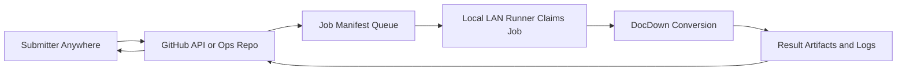
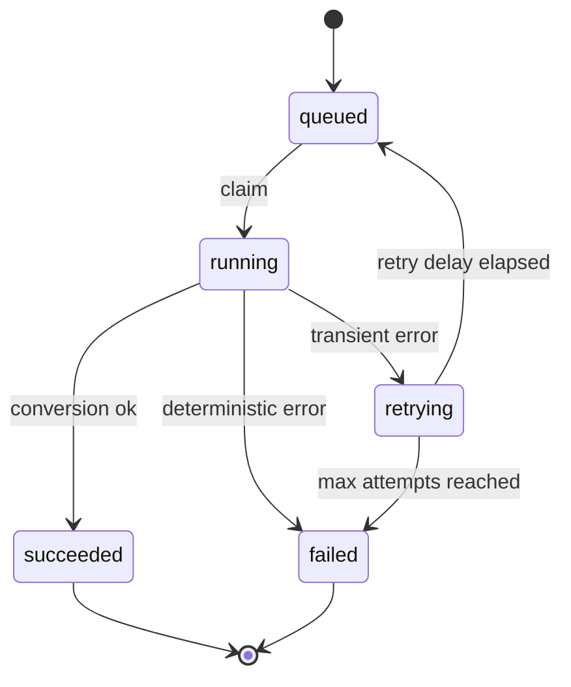

# Task 10.2 - Conversion Workflow Orchestration And Operations Model

## Summary

Define and implement the document-conversion operating workflow so production usage is reliable and aligned with CI/CD deployment behavior.

This task focuses on runtime operations for conversion jobs, not repository validation/deployment automation.

## Dependencies

- Task 10.1 (CI/CD pipeline and deployment workflow)

## Acceptance Criteria

- [x] A conversion workflow model is documented (intake -> queue -> worker -> artifacts -> status).
- [x] Job states are defined and used consistently (`queued`, `running`, `succeeded`, `failed`, `retrying`).
- [x] Retry policy distinguishes transient failures from deterministic failures.
- [x] Artifact storage layout is defined for traceability (input, final markdown, logs, summary per job).
- [x] Idempotency strategy is documented (input hash + options).
- [x] Operational limits are documented (max input size/pages, timeout policy, concurrency caps).
- [x] A runbook exists for start/stop/restart, diagnosis, and recovery for the conversion worker/service.
- [x] CI/CD handoff to runtime workflow is documented (what CD deploys and what it restarts).

## Implementation Notes

### Scope

The goal is to make conversion execution operationally safe in production. CI/CD should deploy and restart runtime components, while this task defines and stabilizes how conversion work is accepted, processed, and observed.

### Operating Constraint

- Conversion execution remains on a local self-hosted runner in LAN.
- Submission and status must be available from anywhere with GitHub access.
- Therefore, runtime orchestration should use GitHub as the control plane and local runner as the execution plane.

### Recommended V1 Architecture

- `docdown-ops` (or equivalent operations repo) hosts job manifests and status updates.
- Submitters create jobs through GitHub-facing channels:
  - workflow dispatch
  - issue/PR command
  - CLI that writes job manifests to ops repo
- Local runner polls/claims jobs from ops repo and performs conversion.
- Results are published back to GitHub (artifacts and/or commit/PR), so submitter can access markdown remotely.

### Recommended Baseline

- Intake:
  - `source.type = git` for v1 default (repo/ref/path)
  - optional `source.type = upload` through CLI helper that uploads to intake repo
- Queue:
  - git-backed job manifests in ops repo (`jobs/queued/*.json`)
- Worker:
  - local runner claims by moving manifest to `jobs/running/`
  - isolated workdir per job (`/opt/docdown/workspace/jobs/<job_id>`)
- Artifacts:
  - per-job output tree containing staged input, final markdown, logs, run summary
  - publish result pointer back to job status in ops repo
- Observability:
  - status file per job (`queued`, `running`, `succeeded`, `failed`, `retrying`)
  - queue depth and age derived from queued manifests

### Job Contract (V1)

Job manifest fields:

- `job_id`: unique id (`YYYYMMDDHHMMSS-<shortsha>-<nonce>`)
- `submitted_at`, `submitted_by`
- `source`:
  - `type`: `git` | `upload`
  - `repo`, `ref`, `path` (for `git`)
  - `artifact_ref` (for `upload`)
- `options`:
  - profile/config overrides allowed by policy
- `idempotency_key`:
  - hash of source locator + options
- `result`:
  - output target mode (`artifact` | `commit` | `pr`)

### Job Lifecycle

Retry policy:

- Retry transient classes only (git clone timeout, network reset, temporary disk pressure).
- Do not retry deterministic classes (invalid PDF, unsupported input, policy violation).
- Include attempt count and last error classification in job status.

### Artifact And Traceability Layout

Per job root:

- `input/`: staged source PDF
- `output/final.md`: final markdown deliverable
- `output/assets/`: extracted images or attachments
- `logs/run.log`: execution log
- `logs/stderr.log`: stderr capture
- `summary.json`: timings, versions, exit status, hash metadata

### Submitter Access Model

- Submitter receives `job_id` immediately.
- Submitter checks status via GitHub-visible job status file or status endpoint.
- On success, submitter gets direct markdown location:
  - artifact download URL, or
  - commit/PR URL containing generated markdown.

### Security And Access Policy

- Allowlist repos for `source.type = git`.
- Use least-privilege token or GitHub App installation for read/write operations.
- Do not read arbitrary LAN-local submitter paths directly from remote requests.
- Treat upload helper as explicit handoff into GitHub-accessible storage.

### Operational Limits (Initial Defaults)

- Max PDF size: 150 MB
- Max pages: 1500
- Max wall-clock per job: 30 minutes
- Max concurrent jobs per runner: 1 (increase after soak)
- Retention:
  - keep last 30 days of artifacts
  - keep failure logs for 60 days

### Integration Boundary With Task 10.1

- Task 10.1 provides CI/CD pipelines and deployment mechanics.
- Task 10.2 provides runtime conversion orchestration and operations policy.
- CD should restart or reload the conversion service defined in this task.

### Operational Verification (2026-04-14)

- Node01 is configured as the active self-hosted CD runner and validated with a green smoke deploy.
- Node02 remains configured as standby/fallback and should stay disabled unless failover is needed.
- DocDownOps runner-loop setup runbook created for node01 primary and node02 standby operation.

### Delivery Plan (V1)

1. [x] Create ops repo structure (`jobs/queued`, `jobs/running`, `jobs/done`, `status`).
2. [x] Implement submit path (`workflow_dispatch` + JSON manifest validation).
3. [x] Implement claim/lock behavior on local runner.
4. [ ] Implement conversion executor with standardized artifact layout.
5. [ ] Publish status transitions and result links to submitter-visible location via runner integration.
6. [x] Add runbook for restart, stuck-job recovery, and replay by `job_id`.
7. [x] Validate node01 primary CD runner end-to-end (registration, prerequisites, and smoke deploy).

## References

- [task-10.0-ci-cd-prerequisites.md](task-10.0-ci-cd-prerequisites.md)
- [task-10.1-ci-cd-pipeline.md](task-10.1-ci-cd-pipeline.md)
- [../technical-design.md](../technical-design.md)
- [../notes/2026-04-14_07-10-00.md](../notes/2026-04-14_07-10-00.md)
- [../notes/2026-04-14_16-20-00-docdownops-runner-setup.md](../notes/2026-04-14_16-20-00-docdownops-runner-setup.md)
