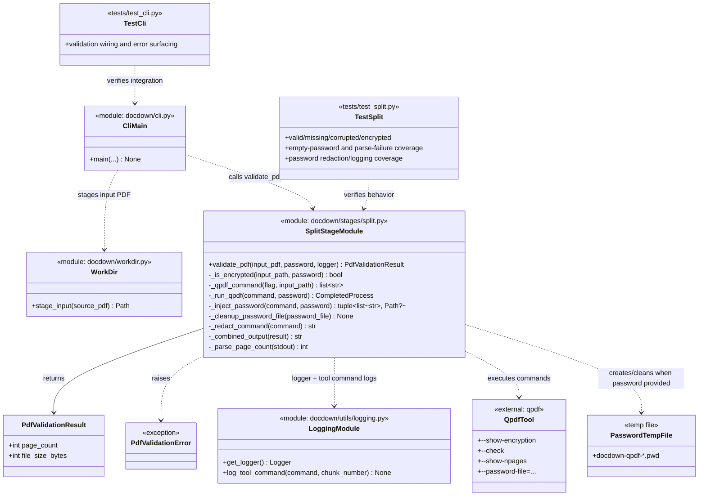

# Task 2.1 — PDF Validation & Page Counting

## Summary

Validate the input PDF and determine its total page count before splitting.

## Dependencies

- Task 1.4 (working directory management)

## Acceptance Criteria

- [x] Input file existence is verified; clear error if missing.
- [x] Input file is validated as a valid PDF (`qpdf --check`).
- [x] Corrupted PDFs produce a clear fatal error with the `qpdf` diagnostic output.
- [x] Encrypted PDFs are detected; if a password is not provided, abort with a message.
- [x] Total page count is extracted (`qpdf --show-npages`).
- [x] Page count and file size are logged at `INFO` level.
- [x] Unit tests cover: valid PDF, missing file, corrupted file, encrypted file, page-count parsing failure.

Implemented in:
- `docdown/stages/split.py`
- `tests/test_split.py`

## Implementation Notes

### Commands

```bash
# Validate
qpdf --check input.pdf

# Page count
qpdf --show-npages input.pdf
```

### Encrypted PDF handling

```bash
qpdf --decrypt --password=PASS input.pdf decrypted.pdf
```

If no password is configured, abort. Do not attempt empty-password decryption by default (could mask issues).

### Error mapping

| qpdf exit code | Meaning            | Pipeline action |
| -------------- | ------------------ | --------------- |
| 0              | Valid              | Continue        |
| 2              | Errors found       | Fatal abort     |
| 3              | Warnings (usable)  | Log warning, continue |

### Artifact Class Diagram



## References

- [technical-design.md §5.1 — Stage 1: Split](../technical-design.md)
- [spec.md §4.1 — Stage 1: Split](../spec.md)
