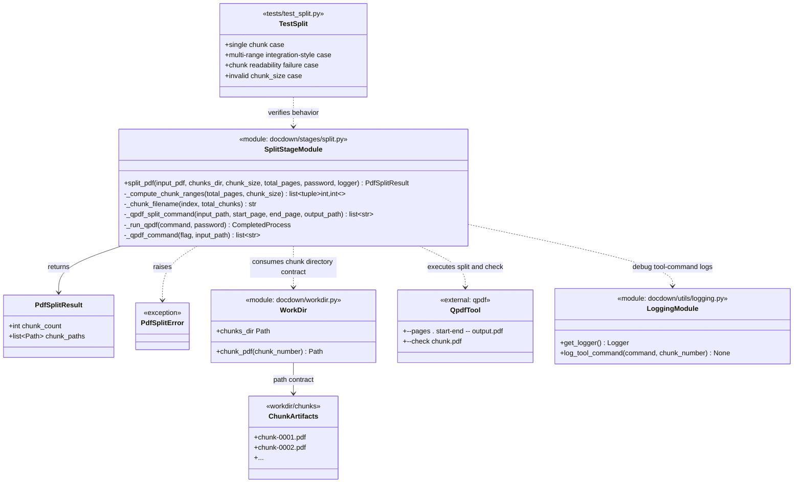

# Task 2.2 — Chunk Splitting with qpdf

## Summary

Split the validated PDF into page-range chunks using `qpdf`.

## Dependencies

- Task 2.1 (PDF validation & page counting)

## Acceptance Criteria

- [x] PDF is split into chunks of `chunk_size` pages (configurable, default 50).
- [x] Last chunk contains the remaining pages (may be smaller than `chunk_size`).
- [x] Output files follow naming convention: `chunk-0001.pdf`, `chunk-0002.pdf`, etc.
- [x] Output files are written to `workdir/chunks/`.
- [x] Chunk count is verified: `ceil(total_pages / chunk_size)` chunks exist.
- [x] Each chunk is validated as a readable PDF.
- [x] Splitting a PDF with fewer pages than `chunk_size` produces a single chunk.
- [x] Integration test: split a multi-page PDF and verify chunk count and page ranges.

Implemented in:
- `docdown/stages/split.py`
- `tests/test_split.py`

## Implementation Notes

### Splitting logic

```python
import math, subprocess

def split_pdf(input_path, chunks_dir, chunk_size, total_pages):
    num_chunks = math.ceil(total_pages / chunk_size)
    for i in range(num_chunks):
        start = i * chunk_size + 1
        end = min((i + 1) * chunk_size, total_pages)
        output = chunks_dir / f"chunk-{i+1:04d}.pdf"
        subprocess.run([
            "qpdf", str(input_path),
            "--pages", ".", f"{start}-{end}", "--",
            str(output)
        ], check=True)
    return num_chunks
```

### Edge cases

- Single-page PDF → one chunk.
- PDF with exactly `chunk_size` pages → one chunk.
- Very large page counts (10,000+) → works as long as the resulting chunk count stays within the fixed-width naming scheme. The current 4-digit convention supports up to 9,999 chunks; if `num_chunks` can exceed that, derive the padding width from `num_chunks` instead of assuming 4 digits.

### Artifact Class Diagram



## References

- [technical-design.md §5.1 — Stage 1: Split](../technical-design.md)
- [spec.md §4.1 — Stage 1: Split](../spec.md)
