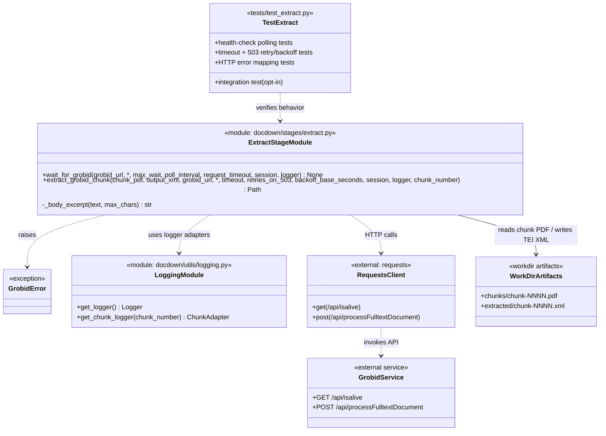

# Task 3.1 — GROBID Integration

## Summary

Implement the primary content extraction method using GROBID's REST API to convert chunk PDFs into TEI XML.

## Dependencies

- Task 1.3 (logging)
- Task 1.4 (working directory management)

## Acceptance Criteria

- [x] GROBID service availability is checked before processing (`GET /api/isalive`).
- [x] Each chunk PDF is submitted to GROBID's `processFulltextDocument` endpoint.
- [x] TEI XML response is written to `workdir/extracted/chunk-NNNN.xml`.
- [x] Per-request timeout is configurable (default: 120 s).
- [x] Timeout/503 errors trigger a single retry with 2× timeout (240 s).
- [x] Exponential backoff on 503: base 5 s, max 3 retries.
- [x] Non-recoverable GROBID errors are reported with HTTP status and body excerpt.
- [x] Extraction time per chunk is logged.
- [x] Unit tests mock the GROBID API; integration test uses a real GROBID container.

Implemented in:
- `docdown/stages/extract.py`
- `tests/test_extract.py`

## Implementation Notes

### GROBID API

```python
import requests

def extract_grobid(chunk_path, output_path, grobid_url, timeout=120):
    with open(chunk_path, "rb") as f:
        resp = requests.post(
            f"{grobid_url}/api/processFulltextDocument",
            files={"input": f},
            timeout=timeout,
        )
    resp.raise_for_status()
    output_path.write_text(resp.text, encoding="utf-8")
```

### Health check

```python
def wait_for_grobid(grobid_url, max_wait=60):
    """Poll /api/isalive until ready or timeout."""
    ...
```

Poll every 2 seconds up to `max_wait`. If GROBID never becomes available, raise a clear error so the orchestrator can switch to the fallback extractor for all chunks.

### Docker lifecycle

GROBID Docker management is **not** part of this task. The pipeline assumes GROBID is already running. Document the startup command in the README:

```bash
docker run -d --name grobid -p 8070:8070 lfoppiano/grobid:0.8.1
```

### Artifact Class Diagram



## References

- [technical-design.md §5.2.1 — GROBID Extraction](../technical-design.md)
- [spec.md §4.2 — Stage 2: Extract](../spec.md)
