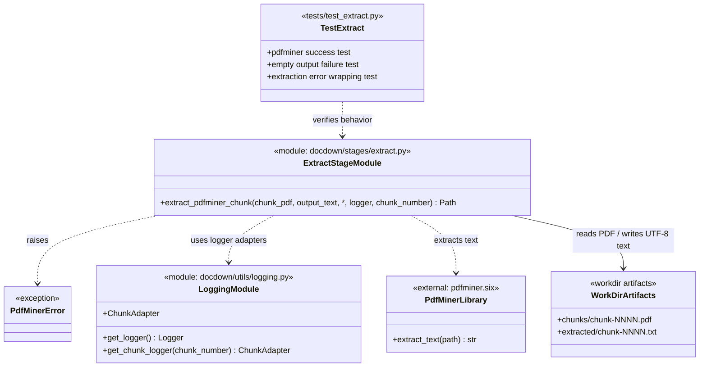

# Task 3.2 — pdfminer.six Fallback Extraction

## Summary

Implement the fallback content extraction method using `pdfminer.six` for chunks where GROBID fails.

## Dependencies

- Task 1.3 (logging)
- Task 1.4 (working directory management)

## Acceptance Criteria

- [x] Text is extracted from a chunk PDF using `pdfminer.six` `extract_text`.
- [x] Output is written to `workdir/extracted/chunk-NNNN.txt` (note: `.txt`, not `.xml`).
- [x] Output encoding is UTF-8.
- [x] Extraction that produces empty output is flagged as a failure.
- [x] Extraction errors (e.g., codec errors) are caught, logged, and reported as failure.
- [x] Extraction time per chunk is logged.
- [x] Unit tests cover: successful extraction, empty output, encoding errors.

Implemented in:
- `docdown/stages/extract.py`
- `tests/test_extract.py`

## Implementation Notes

### Extraction

```python
from pdfminer.high_level import extract_text

def extract_pdfminer(chunk_path, output_path):
    text = extract_text(str(chunk_path))
    if not text.strip():
        raise ExtractionError(f"pdfminer produced empty output for {chunk_path}")
    output_path.write_text(text, encoding="utf-8")
```

### Limitations to document

- No semantic structure (headings, sections) — output is flat text.
- Tables are not preserved — they become space-separated text.
- Images are ignored.

These limitations mean downstream Pandoc conversion from pdfminer output produces lower-quality Markdown than from GROBID TEI XML.

### Artifact Class Diagram



## References

- [technical-design.md §5.2.2 — pdfminer.six Extraction](../technical-design.md)
- [spec.md §4.2 — Stage 2: Extract](../spec.md)
