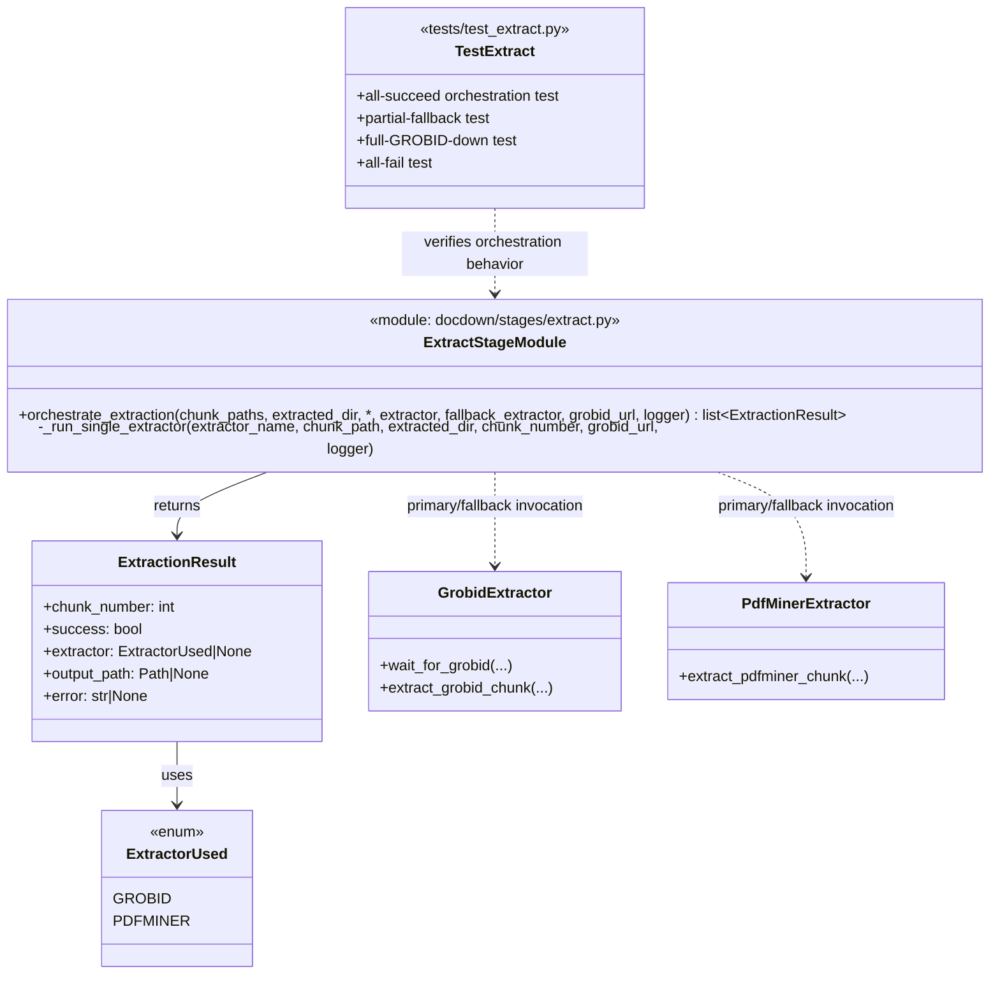

# Task 3.3 — Extraction Orchestration & Fallback Logic

## Summary

Implement the orchestration layer that runs the primary extractor, falls back when it fails, and tracks per-chunk extraction status.

## Dependencies

- Task 3.1 (GROBID integration)
- Task 3.2 (pdfminer fallback)

## Acceptance Criteria

- [x] For each chunk: try primary extractor → on failure, try fallback → on failure, mark as failed.
- [x] Extractor choice is driven by config (`extractor`, `fallback_extractor`).
- [x] Per-chunk result is tracked: `success (grobid)`, `success (pdfminer)`, or `failed`.
- [x] Failed chunks do not block processing of other chunks.
- [x] If GROBID is entirely unreachable, orchestration skips GROBID attempts and uses the configured fallback extractor without per-chunk GROBID retries (or records clear failures when fallback is also GROBID).
- [x] Extraction results are returned as a list for downstream stages to consume.
- [x] Summary logged: N succeeded (grobid), M succeeded (pdfminer), K failed.
- [x] Unit tests cover: all-succeed, partial-failure, full-GROBID-down, all-fail scenarios.

Implemented in:
- `docdown/stages/extract.py`
- `tests/test_extract.py`

## Implementation Notes

### Data model

```python
from dataclasses import dataclass
from enum import Enum
from pathlib import Path

class ExtractorUsed(Enum):
    GROBID = "grobid"
    PDFMINER = "pdfminer"

@dataclass
class ExtractionResult:
    chunk_number: int
    success: bool
    extractor: ExtractorUsed | None
    output_path: Path | None
    error: str | None
```

### Orchestration flow

```python
def extract_chunk(chunk_path, chunk_num, config, workdir):
    # 1. Try primary
    try:
        path = run_extractor(config.extractor, chunk_path, chunk_num, workdir)
        return ExtractionResult(chunk_num, True, config.extractor, path, None)
    except ExtractionError as e:
        log.warning(f"[chunk-{chunk_num:04d}] Primary extractor failed: {e}")
    
    # 2. Try fallback
    try:
        path = run_extractor(config.fallback_extractor, chunk_path, chunk_num, workdir)
        return ExtractionResult(chunk_num, True, config.fallback_extractor, path, None)
    except ExtractionError as e:
        log.error(f"[chunk-{chunk_num:04d}] Fallback extractor failed: {e}")
        return ExtractionResult(chunk_num, False, None, None, str(e))
```

### Artifact Class Diagram



## References

- [technical-design.md §5.2.3 — Fallback Logic](../technical-design.md)
