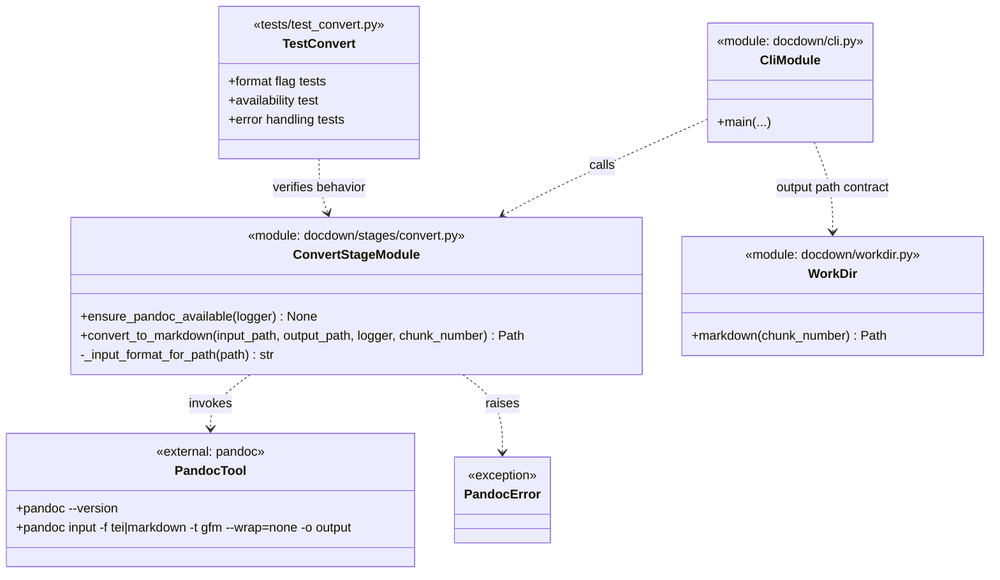

# Task 4.1 — Pandoc Conversion

## Summary

Convert extracted intermediate files (TEI XML or plain text) into GitHub-Flavored Markdown using Pandoc.

## Dependencies

- Task 1.4 (working directory management)

## Acceptance Criteria

- [x] TEI XML files (from GROBID) are converted to GFM Markdown via Pandoc.
- [x] Plain text files (from pdfminer) are converted to GFM Markdown via Pandoc.
- [x] Input format is selected based on file extension (`.xml` → TEI, `.txt` → markdown-compatible plain text).
- [x] `--wrap=none` is used to prevent hard line wrapping.
- [x] Output is written to `workdir/markdown/chunk-NNNN.md`.
- [x] Pandoc errors are caught and reported with stderr output.
- [x] Conversion time per chunk is logged.
- [x] Unit tests verify correct Pandoc flags for each input format.

Implemented in:
- `docdown/stages/convert.py`
- `docdown/cli.py`
- `tests/test_convert.py`
- `tests/test_cli.py`

## Implementation Notes

### Commands

```python
import subprocess

def convert_to_markdown(input_path, output_path):
    input_format = "tei" if input_path.suffix == ".xml" else "plain"
    subprocess.run([
        "pandoc", str(input_path),
        "-f", input_format,
        "-t", "gfm",
        "--wrap=none",
        "-o", str(output_path),
    ], check=True, capture_output=True, text=True)
```

### Artifact Class Diagram



### Pandoc availability

Verify Pandoc is installed at pipeline startup:

```python
subprocess.run(["pandoc", "--version"], check=True, capture_output=True)
```

If missing, abort with a message directing the user to install Pandoc.

### Edge cases

- Empty input file → Pandoc produces empty output → downstream validation (Task 8.1) will catch this.
- Malformed TEI XML → Pandoc may produce partial output or fail → catch and log.

## References

- [technical-design.md §5.3 — Stage 3: Convert to Markdown](../technical-design.md)
- [spec.md §4.3 — Stage 3: Convert to Markdown](../spec.md)
