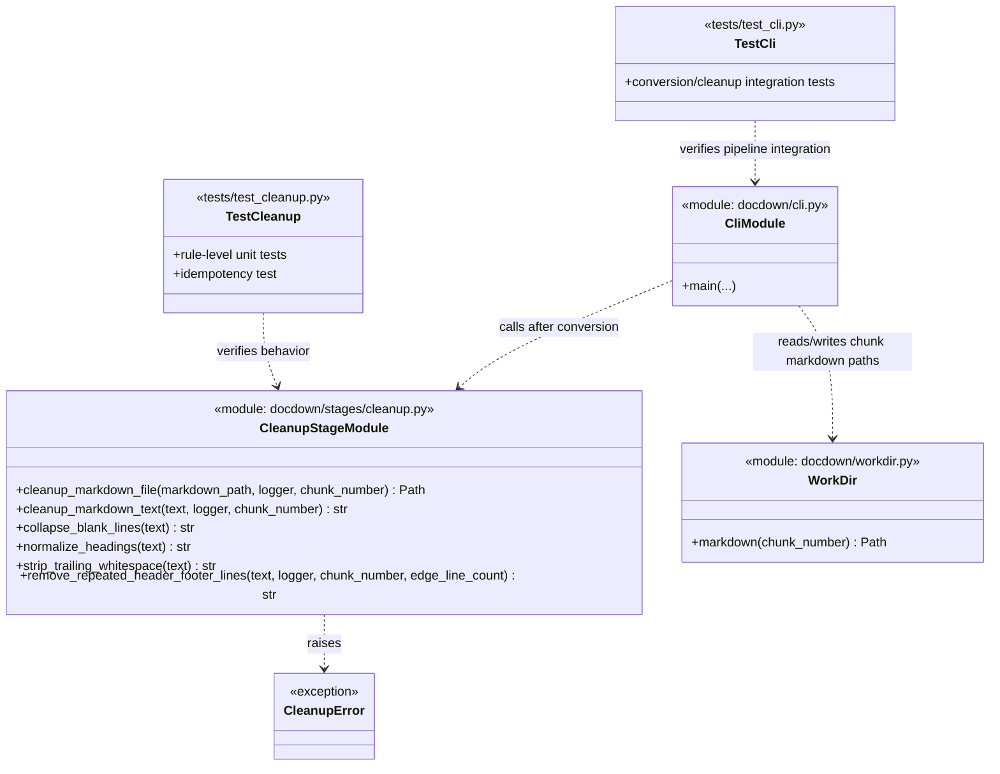

# Task 4.2 — Post-Conversion Markdown Cleanup

## Summary

Apply automated cleanup rules to each chunk's Markdown output to normalise formatting and remove extraction artefacts.

## Dependencies

- Task 4.1 (Pandoc conversion)

## Acceptance Criteria

- [x] Excessive blank lines are collapsed (>2 consecutive → 2).
- [x] Heading levels are normalised: no chunk starts below `##` (reserve `#` for document title).
- [x] Repeated page header/footer lines are detected and removed.
- [x] Trailing whitespace on each line is stripped.
- [x] Output overwrites the chunk Markdown file in place.
- [x] Cleanup is idempotent (running twice produces the same result).
- [x] Unit tests cover each cleanup rule independently.

Implemented in:
- `docdown/stages/cleanup.py`
- `docdown/cli.py`
- `tests/test_cleanup.py`
- `tests/test_cli.py`

## Implementation Notes

### Blank line collapsing

```python
import re

def collapse_blank_lines(text):
    return re.sub(r"\n{3,}", "\n\n", text)
```

### Heading normalisation

If a chunk starts with `# Heading`, demote to `## Heading` (since `#` is reserved for the final merged document title). Only adjust if the chunk contains `#`-level headings.

```python
def normalize_headings(text):
    if re.search(r"^# ", text, re.MULTILINE):
        text = re.sub(r"^(#{1,5}) ", lambda m: "#" + m.group(1) + " ", text, flags=re.MULTILINE)
    return text
```

### Repeated header/footer detection

- Read first and last 2 lines of each page-equivalent block.
- If the same line appears in >50% of blocks, flag it as a repeating header/footer.
- Remove all instances.

This is a heuristic — false positives are possible. Log removals at `DEBUG` level.

### Artifact Class Diagram



## References

- [technical-design.md §5.3 — Post-conversion cleanup](../technical-design.md)
