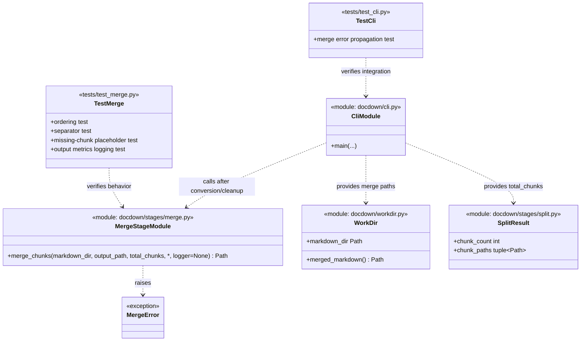

# Task 6.1 — Chunk Merging

## Summary

Concatenate all chunk Markdown files into a single merged document in correct order.

## Dependencies

- Task 4.2 (Markdown cleanup — chunk .md files ready)

## Acceptance Criteria

- [x] All chunk Markdown files in `workdir/markdown/` are concatenated in numeric order.
- [x] A horizontal rule (`---`) is inserted between chunks as a visual separator.
- [x] Failed/missing chunks are represented in the merged output with a placeholder comment: `<!-- chunk-NNNN: extraction failed -->`.
- [x] Output is written to `workdir/merged.md`.
- [x] Total line count and file size of merged output are logged.
- [x] Unit tests verify: correct ordering, separator insertion, missing-chunk handling.

Implemented in:
- `docdown/stages/merge.py`
- `docdown/cli.py`
- `tests/test_merge.py`
- `tests/test_cli.py`

## Implementation Notes

### Implementation

```python
from pathlib import Path
import stat
from docdown.utils.logging import get_logger


class MergeError(ValueError):
    pass

def merge_chunks(markdown_dir, output_path, total_chunks, *, logger=None):
    if total_chunks < 1:
        raise MergeError(f"total_chunks must be >= 1, got {total_chunks}")

    source_dir = Path(markdown_dir)
    target = Path(output_path)
    active_logger = logger or get_logger()

    if not source_dir.exists():
        raise MergeError(f"Markdown directory not found: {source_dir}")
    if not source_dir.is_dir():
        raise MergeError(f"Markdown path is not a directory: {source_dir}")

    try:
        target.parent.mkdir(parents=True, exist_ok=True)
        newline_count = 0
        wrote_any = False
        with target.open("w", encoding="utf-8", newline="") as f:
            for i in range(1, total_chunks + 1):
                part = _chunk_part(source_dir, i)  # returns content or placeholder
                if wrote_any:
                    separator = "\n\n---\n\n"
                    f.write(separator)
                    newline_count += separator.count("\n")
                f.write(part)
                newline_count += part.count("\n")
                wrote_any = True

        file_size = target.stat().st_size
    except OSError as exc:
        raise MergeError(f"Failed writing merged markdown to {target}: {exc}") from exc

    line_count = newline_count + (1 if wrote_any else 0)
    active_logger.info("Merged markdown output: lines=%s size_bytes=%s path=%s", line_count, file_size, target)
    return target


def _chunk_part(markdown_dir, chunk_number):
    chunk_path = markdown_dir / f"chunk-{chunk_number:04d}.md"
    try:
        stat_info = chunk_path.stat()
    except FileNotFoundError:
        return f"<!-- chunk-{chunk_number:04d}: extraction failed -->"
    except OSError as exc:
        raise MergeError(f"Failed reading chunk markdown {chunk_path}: {exc}") from exc

    if not stat.S_ISREG(stat_info.st_mode):
        raise MergeError(f"Chunk markdown path is not a file: {chunk_path}")

    if stat_info.st_size == 0:
        return f"<!-- chunk-{chunk_number:04d}: extraction failed -->"

    try:
        text = chunk_path.read_text(encoding="utf-8").rstrip("\r\n")
    except OSError as exc:
        raise MergeError(f"Failed reading chunk markdown {chunk_path}: {exc}") from exc

    return text if text.strip() else f"<!-- chunk-{chunk_number:04d}: extraction failed -->"
```

### Ordering

Rely on the fixed-width `chunk-NNNN` naming convention. With zero-padded chunk numbers, lexicographic ordering is stable, but the implementation should still iterate by chunk number so missing chunks can be represented with placeholder comments.

### Artifact Class Diagram



## References

- [technical-design.md §5.5.1 — Merge](../technical-design.md)
- [spec.md §4.5 — Stage 5: Merge & Generate TOC](../spec.md)
