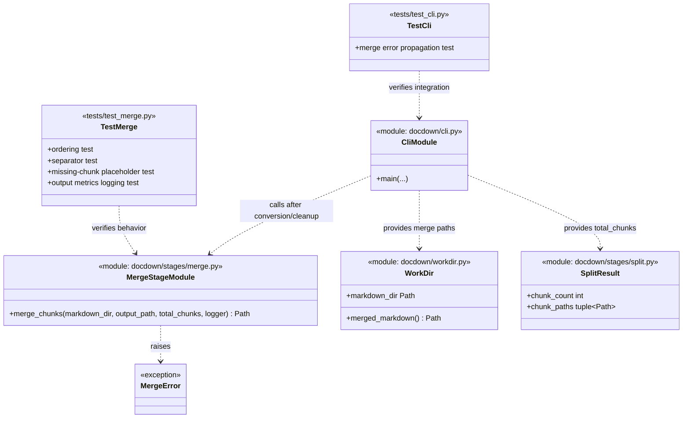

# Task 6.1 — Chunk Merging

## Summary

Concatenate all chunk Markdown files into a single merged document in correct order.

## Dependencies

- Task 4.2 (Markdown cleanup — chunk .md files ready)

## Acceptance Criteria

- [x] All chunk Markdown files in `workdir/markdown/` are concatenated in numeric order.
- [x] A horizontal rule (`---`) is inserted between chunks as a visual separator.
- [x] Failed/missing chunks are represented in the merged output with a placeholder comment: `<!-- chunk-NNNN: extraction failed -->`.
- [x] Output is written to `workdir/merged.md`.
- [x] Total line count and file size of merged output are logged.
- [x] Unit tests verify: correct ordering, separator insertion, missing-chunk handling.

Implemented in:
- `docdown/stages/merge.py`
- `docdown/cli.py`
- `tests/test_merge.py`
- `tests/test_cli.py`

## Implementation Notes

### Implementation

```python
def merge_chunks(markdown_dir, output_path, total_chunks):
    parts = []
    for i in range(1, total_chunks + 1):
        chunk_path = markdown_dir / f"chunk-{i:04d}.md"
        if chunk_path.exists() and chunk_path.stat().st_size > 0:
            parts.append(chunk_path.read_text(encoding="utf-8"))
        else:
            parts.append(f"<!-- chunk-{i:04d}: extraction failed -->\n")
    
    merged = "\n\n---\n\n".join(parts)
    with output_path.open("w", encoding="utf-8", newline="") as f:
        f.write(merged)
```

### Ordering

Rely on the fixed-width `chunk-NNNN` naming convention. With zero-padded chunk numbers, lexicographic ordering is stable, but the implementation should still iterate by chunk number so missing chunks can be represented with placeholder comments.

### Artifact Class Diagram



## References

- [technical-design.md §5.5.1 — Merge](../technical-design.md)
- [spec.md §4.5 — Stage 5: Merge & Generate TOC](../spec.md)
