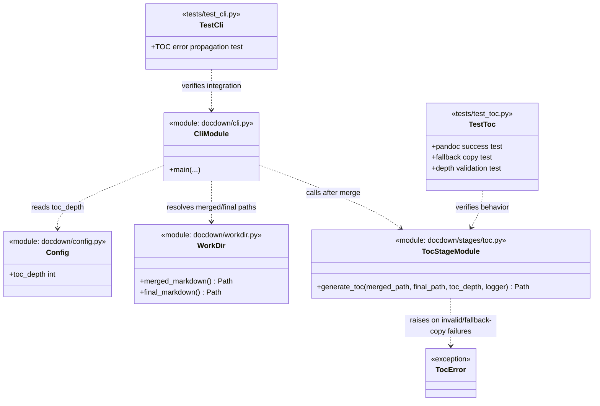

# Task 6.2 — TOC Generation

## Summary

Generate a Table of Contents from the merged Markdown headings using Pandoc.

## Dependencies

- Task 6.1 (chunk merging — `merged.md` must exist)

## Acceptance Criteria

- [x] Pandoc generates a TOC from `merged.md` headings up to depth 3 (`#`, `##`, `###`).
- [x] TOC is inserted at the top of the document.
- [x] Output is written to `workdir/final.md`.
- [x] If Pandoc fails, `merged.md` is copied to `final.md` without a TOC (degraded but usable).
- [x] TOC depth is configurable (default: 3).
- [x] Log the number of TOC entries generated.
- [x] Unit test verifies TOC is present in output for a document with headings.

Implemented in:
- `docdown/stages/toc.py`
- `docdown/cli.py`
- `docdown/config.py`
- `tests/test_toc.py`
- `tests/test_cli.py`
- `tests/test_config.py`

## Implementation Notes

### Implementation

```bash
pandoc merged.md -f gfm -t gfm --toc --toc-depth=3 -o final.md
```

TOC generation now runs in a dedicated stage (`docdown/stages/toc.py`) with the following behavior:

- Primary path: invoke Pandoc with `--toc` and configurable `--toc-depth`.
- Fallback path: if Pandoc execution fails (missing binary or non-zero exit), copy `merged.md` to `final.md` and log a degraded-mode warning.
- Metrics: log TOC entry count based on headings found in `merged.md` up to configured depth.

```python
from docdown.stages.toc import generate_toc

generate_toc(
    work_dir.merged_markdown(),
    work_dir.final_markdown(),
    toc_depth=cfg.toc_depth,
    logger=logger,
)
```

### Artifact Class Diagram



## References

- [technical-design.md §5.5.2 — TOC Generation](../technical-design.md)
- [spec.md §4.5 — Stage 5: Merge & Generate TOC](../spec.md)
